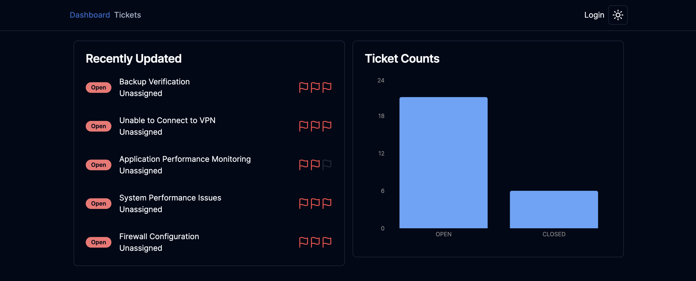

# Navigate to page

<!DOCTYPE html>
<html lang="en">
<head>
    <meta charset="UTF-8">
    <meta name="viewport" content="width=device-width, initial-scale=1.0">
</head>
<body>
    

        
    

</body>
</html>

<!-- # Architecture -->

## Services Used

- TypeScript

### Frontend

- Next.js
- ShadCn-UI
- Tailwind CSS

### Backend

- Prisma
- NextAuth
- MySQL

### Deployment

- Vercel

### Amazon

- CloudFormation (TypeScript)
- Relational Database Service (RDS)
